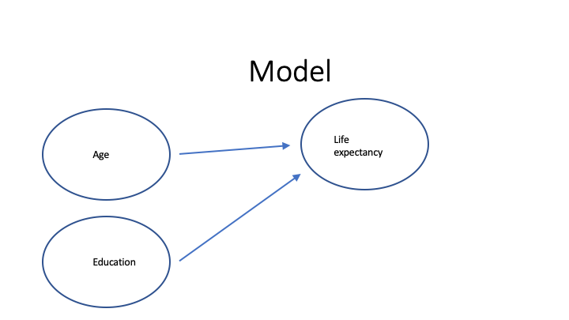

```{r setup, include=FALSE}
knitr::opts_chunk$set(echo = TRUE)
#knitr::opts_chunk$set(cache = TRUE)
library(knitr) ## need for include_graphics()
```

# Contents

This R Markdown file (.Rmd) contains a brief overview of R Markdown files and
exmples of:

* basic markdown
* how to include code:
  + inline
  + chunks & options
* formulas with \LaTeX 
* including figures (and references, e.g. "In Figure X, we see...")
* including tables (and references, e.g., "Results are shown in Table X...")
* cross-references for sections (with links)

*Brief note:* This file actually uses the R package `bookdown` (as opposed
to the `rmarkdown` package) which provides a few more bells and whistles,
particularly for creating academic articles.  For more details, check out the
[The Definitive Guide](https://bookdown.org/yihui/rmarkdown/bookdown-markdown.html#bookdown-markdown).


# Brief Overview

# Markdown

Examples in a nested list:

* Bold
    + **two asterisks** or __two underscores__
    + **2 \*\*** and this is regular type face
    + \underline{test}
    + \textcolor{red}{is this red?} -- need xcolor \LaTeX package
* Italics
    + *italics* or _italics_
* Links: [IPR](https://ipr.osu.edu)
* Sections: pound signs / hashtags / \#


# Formulas with \LaTeX

$Y_i = \alpha + \beta_1 * x_{1,i} + \beta_2 * x_{2,i} + \epsilon_i$

Where $e \sim \mbox{Normal}(\mu, \sigma)$.

# Code

This section has 2 subsections that provide examples of including (1) inline code and (2) code chunks.

## Inline Code

Let's take a look at the mtcars data set which has `r nrow(mtcars)` observations and `r ncol(mtcars)` variables.


## Code Chunks

```{r show_all}
summary(cars)
```


What if we **don't want the r code**?

```{r show_resules, echo=FALSE}
summary(cars)
```


What if we **don't want the results**?

```{r show_and_run_code, results='hide'}
new_var <- mtcars$mpg - mean(mtcars$mpg)
```

Did it work?  If so we should see that the mean of a centered variable is `r mean(new_var)`.


# Plots

```{r plot1, echo=FALSE}
plot(mtcars$hp, mtcars$mpg)
```


```{r fig1a, echo=FALSE}

```


We can also automatically number and reference our figures and tables.^[This gives me a LaTeX Warning about multiply-defined labels, which is slightly annoying.]  Note that Figure \ref{fig:fig1b} is a little smaller and has a caption.

```{r fig1b, echo=FALSE, out.width="50%", fig.cap="Earth-shattering model"}

```


# Tables

Check out Table \ref{tab:tab1}

```{r tab1}
library(dplyr)
newDF <- mtcars %>% summarize(across(where(is.numeric), list(mean = mean, sd = sd)))
tab1 <- matrix(newDF, nrow = ncol(mtcars), byrow = TRUE)
rownames(tab1) <- names(mtcars)
colnames(tab1) <- c('Mean', 'Std Dev')
kable(tab1, caption  = "Descriptive Statistics")
```


This is *much* easier with the [stargazer](https://cran.r-project.org/web/packages/stargazer/index.html) (which
has a useful [vignette](https://cran.r-project.org/web/packages/stargazer/vignettes/stargazer.pdf)).  

```{r tab2, results="asis"}
library(stargazer)
stargazer(mtcars, header = FALSE, type = "latex")
```


```{r reg, results="asis"}
mod1 <- lm(mpg ~ wt, data = mtcars)
mod2 <- lm(mpg ~ wt + hp, data = mtcars)
stargazer(mod1, mod2, header = FALSE, type = "latex")
```

# Cross-References for Sections

We need to label the section.  For example, remember the earlier section Code Chunks?  Here
is a link to [Code Chunks]

